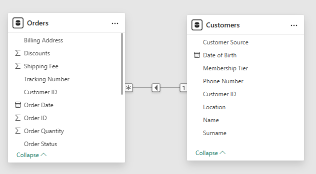
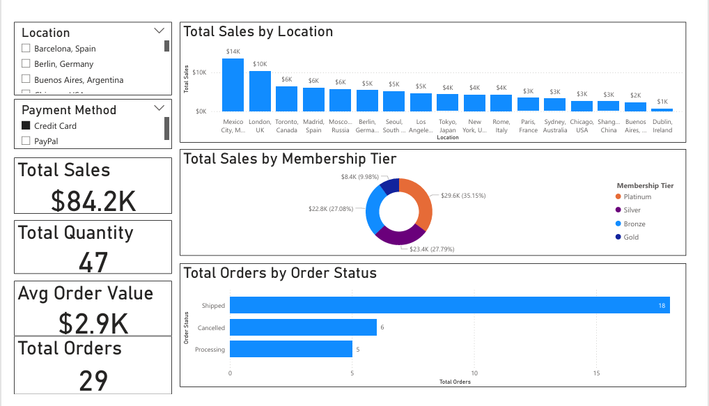

# 📊 AdventureWorks Power BI Sales Analysis
### 🎓 Microsoft Power BI Data Analyst Specialization - Portfolio Project

---

## 📑 Table of Contents
- [Overview](#-overview)
- [Business Task](#-business-task)
- [Dataset Detail](#-dataset-detail)
- [Tools & Technologies Used](#-tools--technologies-used)
- [Skills Demonstrated](#-skills-demonstrated)
- [Project Workflow](#-project-workflow)
- [Results](#-results)
- [Key Findings](#-key-findings)
- [About this Project](#-about-this-project)

---

## 🔍 Overview
This project demonstrates end-to-end **data modeling, optimization, and dashboard creation in Power BI** using AdventureWorks sales data. The focus is on building an efficient data model, applying best practices, and delivering actionable business insights through an interactive dashboard.

---

## 🎯 Business Task
AdventureWorks is facing **stagnant sales performance** and needs better visibility into:
- Sales performance across locations
- Customer membership contribution
- Order status distribution
- Overall revenue and order behavior  

The goal is to **design an optimized data model and dashboard** to support data-driven decision-making.

---

## 🗂️ Dataset Detail
The dataset includes two core tables:
- **Customers**: Customer demographics, membership tier, and location details
- **Orders**: Transaction-level sales data including order totals, quantities, payment methods, and order status

The data was provided as part of the **Microsoft Power BI Data Analyst Specialization**.

---

## 🛠️ Tools & Technologies Used
- **Microsoft Power BI Desktop**
- **DAX (Data Analysis Expressions)**
- **Power BI Data Modeling**
- **Power BI Visualizations**

---

## 🧠 Skills Demonstrated
- Data modeling (Star Schema)
- Relationship configuration (One-to-Many)
- Data type optimization
- DAX measure creation
- Performance optimization (Auto Date/Time disabled)
- Interactive dashboard design
- Business-focused data storytelling

---

## 🧭 Project Workflow
1. **Data Loading**
   - Imported Customers and Orders datasets into Power BI

2. **Data Preparation**
   - Optimized data types for accuracy and performance
   - Verified numeric, text, and date fields

3. **Data Modeling**
   - Built a one-to-many relationship between Customers and Orders
   - Applied single-direction filtering
   - Disabled Auto Date/Time for performance optimization

4. **DAX Measures**
   - Created core business measures such as Total Sales, Total Orders, Total Quantity, and Average Order Value

5. **Dashboard Development**
   - Designed KPI cards for high-level metrics
   - Built visuals for sales by location, membership tier, and order status
   - Added slicers for interactive filtering

---

## 📈 Results

| 1. Data Model Relationship |
|----------------------------|
|  |
| Optimized one-to-many relationship between Customers and Orders ensuring efficient filtering and performance. |

| 2. Sales Dashboard |
|--------------------|
|  |
| Interactive Power BI dashboard presenting KPIs, sales distribution, and order insights. |

---

## 🔑 Key Findings
- Sales performance varies significantly by **customer location**
- **Membership tiers** contribute differently to total revenue
- Majority of orders are successfully **shipped**, indicating stable operations
- KPI metrics provide quick visibility into overall business health

---

## ℹ️ About this Project
- This project was completed as part of the **Data Modeling in Power BI** course within the **Microsoft Power BI Data Analyst Specialization**.  
- It is designed as a **portfolio project** to showcase practical Power BI skills aligned with real-world business scenarios and industry best practices.
