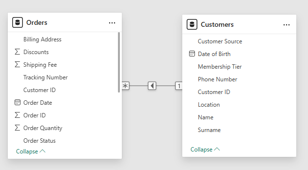
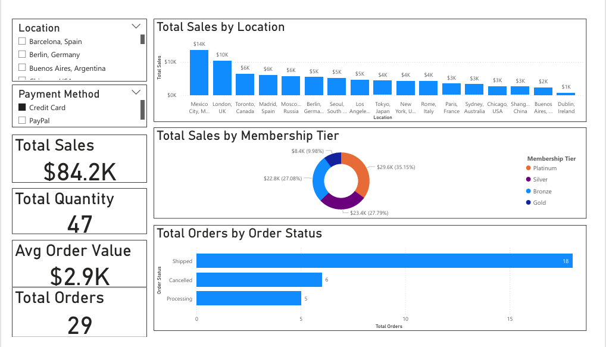

# AdventureWorks Regional Sales Performance Dashboard
### Microsoft Power BI Data Analyst Specialization - Portfolio Project

---

## Table of Contents

- [Overview](#overview)
- [Business Task](#business-task)
- [Objectives](#objectives)
- [Dataset](#dataset)
- [Tools & Technologies](#tools--technologies)
- [Methodology](#methodology)
- [Data Model & DAX Measures](#data-model--dax-measures)
- [Results](#results)
- [Key Performance Indicators](#key-performance-indicators)
- [Key Findings](#key-findings)
- [About This Project](#about-this-project)

---

## Overview

This project demonstrates end-to-end data modeling, optimization, and dashboard creation in Power BI using AdventureWorks regional sales data. The focus is on building an efficient, well-structured data model and delivering an interactive dashboard that turns stagnant-sales visibility gaps into actionable regional insight.

---

## Business Task

AdventureWorks was facing stagnant sales performance and needed better visibility into:

- Sales performance across locations
- Customer membership contribution
- Order status distribution
- Overall revenue and order behavior

The goal was to design an optimized data model and dashboard to support data-driven decision-making around these gaps.

---

## Objectives

- Build a clean one-to-many data model between customers and orders
- Optimize the model for performance rather than just functional correctness
- Create core DAX measures needed for regional and membership-level analysis
- Deliver an interactive dashboard that surfaces location- and tier-level performance differences at a glance

---

## Dataset

| Table | Contents |
|---|---|
| Customers | Customer demographics, membership tier, and location details |
| Orders | Transaction-level sales data - order totals, quantities, payment methods, order status |

Data was provided as part of the Microsoft Power BI Data Analyst Specialization.

---

## Tools & Technologies

| Category | Tools |
|---|---|
| Application | Microsoft Power BI Desktop |
| Calculations | DAX (Data Analysis Expressions) |
| Modeling | Power BI Data Modeling |
| Visualization | Power BI Visualizations |

---

## Methodology

**1. Data Loading**
Imported the Customers and Orders datasets into Power BI.

**2. Data Preparation**
Optimized data types for accuracy and performance, and verified numeric, text, and date fields before modeling.

**3. Data Modeling**
Built a one-to-many relationship between Customers and Orders, applied single-direction filtering, and disabled Auto Date/Time to improve model performance.

**4. DAX Measures**
Created core business measures - Total Sales, Total Orders, Total Quantity, and Average Order Value - to support consistent, reusable calculations across visuals.

**5. Dashboard Development**
Designed KPI cards for high-level metrics, built visuals for sales by location, membership tier, and order status, and added slicers for interactive filtering.

---

## Data Model & DAX Measures

- **Relationship:** One-to-many between Customers and Orders, with single-direction filtering to keep the model predictable and fast.
- **Performance optimization:** Auto Date/Time disabled to reduce model overhead and improve refresh/load performance.
- **Core DAX measures:** Total Sales, Total Orders, Total Quantity, Average Order Value.

---

## Results

All screenshots in [`Results/`](./Results).

| # | Result | Screenshot |
|---|--------|------------|
| 1 | Data Model Relationship - optimized one-to-many relationship between Customers and Orders for efficient filtering and performance |  |
| 2 | Sales Dashboard - interactive dashboard presenting KPIs, sales distribution, and order insights |  |

---

## Key Performance Indicators

| KPI | Tracked Via |
|---|---|
| Total Sales | DAX measure |
| Total Orders | DAX measure |
| Total Quantity | DAX measure |
| Average Order Value | DAX measure |
| Sales by Location | Dashboard visual |
| Sales by Membership Tier | Dashboard visual |
| Order Status Distribution | Dashboard visual |

---

## Key Findings

- Sales performance varies significantly by customer location, pointing to specific regions as priority targets for the stagnant-sales issue the project set out to address.
- Membership tiers contribute unevenly to total revenue, indicating that not all loyalty segments carry equal weight in driving sales.
- The majority of orders are successfully shipped, suggesting the operational fulfillment side of the business is stable and not a primary driver of the sales stagnation.
- Consolidated KPI cards give a fast read on overall business health, reducing the time needed to spot where performance issues are concentrated.

---

## About This Project

This project was completed as part of the Data Modeling in Power BI course within the Microsoft Power BI Data Analyst Specialization. It is designed as a portfolio project to showcase practical Power BI skills aligned with real-world business scenarios and industry best practices.

---
